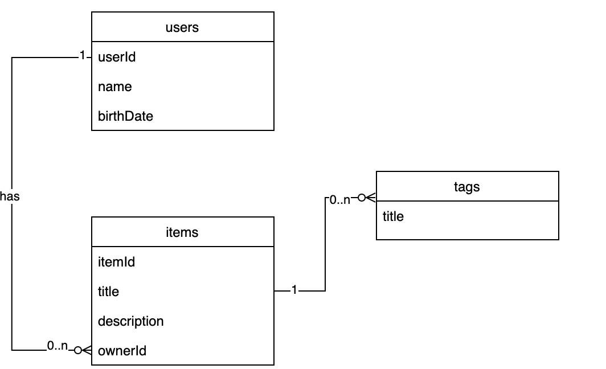

# Cassandra

## Task

### Task implementation

C2C shop with 3 logical entities - users, items, tags.
The aim of this program is to try out designing a Cassandra database and play with different queries.

---

### Logical data model

The tables have been simplified, as the data were entered into the tables manually. Only the most important attributes are left in all tables.



---

## Run the program

### Prerequisites for macOS

- Install [node.js](https://nodejs.org/en/)
- Install [Cassandra](https://www.javatpoint.com/how-to-install-cassandra-on-mac): `brew install cassandra`
- If you're getting Java errors, install a newer version of Java Native Access ([check here](https://stackoverflow.com/questions/69486339/nativelibrarydarwin-java64-failed-to-link-the-c-library-against-jna-native-m))

### Setup Cassandra

Open Cassandra shell:

```zsh
cqlsh
```

Create keyspace `shop`:

```zsh
CREATE KEYSPACE IF NOT EXISTS shop WITH REPLICATION = { 'class' : 'SimpleStrategy', 'replication_factor' : 1 };
```

### Launch program

1. Install `pnpm`: `npm install -g pnpm`
2. Install npm modules: `pnpm install`
3. Launch MongoDB server: `pnpm run start-server`
    - If it tells you that port 7199 is already used, try to kill it. If still no success, try killing Java process via Activity Monitor.
4. Execute the program: `pnpm run start`

Alternatively, use `npm`.
